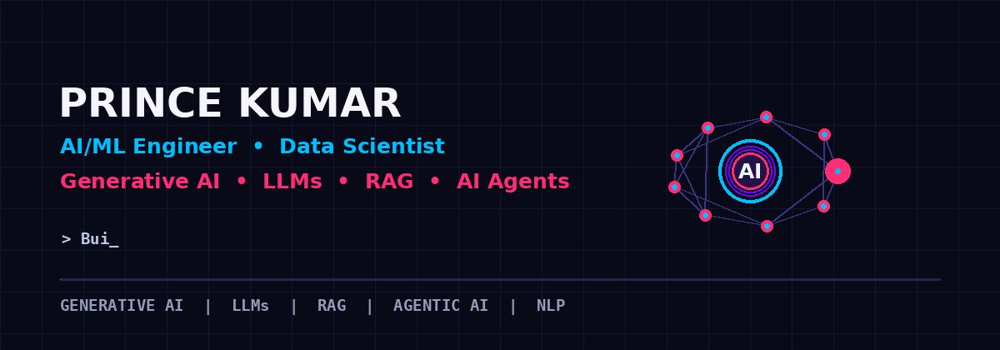

<!-- ========================================================= -->
<!--                    PRINCE KUMAR PROFILE                   -->
<!-- ========================================================= -->

<!-- ========================= HERO ========================== -->

<p align="center">
  
</p>

<br>

<h1 align="center">
  🤖 Prince Kumar
</h1>

<h3 align="center">
  AI/ML Engineer • Data Scientist • Data Analyst • GenAI Engineer
</h3>

<p align="center">
  <b>
    Generative AI • LLMs • RAG • AI Agents • NLP • Full-Stack AI
  </b>
</p>

<p align="center">


</p>
<br>
<!-- ===================== NEON DIVIDER ====================== -->

<p align="center">
  
</p>

<!-- ======================== BADGES ========================= -->

<p align="center">

  

  

  

  

</p>

<br>

<!-- ======================== INTRO ========================== -->

<h2 align="center">
  🚀 Building Intelligent AI Systems
</h2>

<p align="center">
  Turning <b>Data + AI + LLMs + RAG + Agents</b>
  into practical intelligent applications.
</p>

<br>

<!-- ======================== ABOUT ========================== -->

## 🧠 About Me

🎓 **B.Tech Graduate — Computer Science & Engineering (AI & ML)**

💻 I build practical solutions across **Data Science, Machine Learning,
Generative AI, Data Analytics and Full-Stack Development.**

🚀 Worked on **120+ projects and practical builds** across AI, ML,
Data Science, Analytics, Backend and Full-Stack development.

🤖 Interested in building **AI-powered applications, intelligent agents,
RAG systems, LLM applications and data-driven solutions.**

📊 Passionate about transforming **raw data into insights, models
and intelligent applications.**

🎯 **Career Focus:** AI/ML Engineering • Data Science • Data Analytics •
GenAI • LLM Engineering • Backend Development

---

<!-- ======================= WHAT I DO ======================= -->

## ⚡ What I Do

<table>
<tr>

<td width="50%">

### 🤖 Artificial Intelligence

AI Applications  
AI Automation  
AI Agents  
Intelligent Systems

### 🧠 Machine Learning

Machine Learning  
Deep Learning  
Predictive Modeling  
Classification

### ✨ Generative AI

LLMs  
RAG  
Prompt Engineering  
AI Agents

### 🔎 NLP

Natural Language Processing  
Embeddings  
Vector Search  
Document Intelligence

</td>

<td width="50%">

### 📊 Data Science

Python  
Pandas  
NumPy  
EDA  
Statistics

### 📈 Data Analytics

SQL  
Power BI  
Excel  
Dashboards

### ⚙️ Backend Development

Django  
Flask  
REST APIs  
Docker

### 🌐 Full-Stack AI

Frontend  
Backend  
APIs  
Database  
AI Integration

</td>

</tr>
</table>

---

<!-- ====================== TECH STACK ======================= -->

## 🛠️ Tech Stack

### 🐍 Programming & Development

<p align="center">


</p>

### 🌐 Web & Backend

<p align="center">


</p>

<p align="center">

<b>
Python • SQL • Django • Flask • REST APIs • Docker • Git • GitHub
</b>

</p>

### 🤖 AI / ML

<p align="center">

🐍 Python • 🧠 Machine Learning • 🧬 Deep Learning • 🔎 NLP  
✨ Generative AI • 🧠 LLMs • 🔗 RAG • 🤖 AI Agents  
👁️ Computer Vision • GANs • Recommendation Systems

</p>

### 📊 Data & Analytics

<p align="center">

Pandas • NumPy • Matplotlib • Seaborn • Scikit-learn  
EDA • Data Cleaning • Feature Engineering • Power BI • Excel • SQL

</p>

---

<!-- ====================== PROJECTS ========================= -->

## 🚀 Featured AI & Data Projects

<table>

<tr>

<td width="50%">

### 🤖 01. Agentic AI / RAG Chatbot

LLMs • RAG • AI Agents • NLP • Vector Search • APIs

</td>

<td width="50%">

### 💰 02. AI Expense Tracker

Python • OCR • SQL • AI • Analytics • Visualization

</td>

</tr>

<tr>

<td>

### 📊 03. Customer Churn Prediction

Python • Pandas • EDA • Feature Engineering • Scikit-learn

</td>

<td>

### 🕵️ 04. Fraud Detection System

Random Forest • Isolation Forest • Python • ML

</td>

</tr>

<tr>

<td>

### 💼 05. Job Recommendation Engine

Python • NLP • Machine Learning • Recommendation Systems

</td>

<td>

### 📰 06. Fake News Detection

NLP • TF-IDF • Naive Bayes • Python • Streamlit

</td>

</tr>

<tr>

<td>

### 🌡️ 07. Climate / Temperature Prediction

Python • Pandas • Scikit-learn • EDA • Data Visualization

</td>

<td>

### 🧠 08. Nova AI Assistant

AI • NLP • APIs • Automation

</td>

</tr>

<tr>

<td>

### 🎙️ 09. Jarvish AI

Multimodal AI • Voice • Avatar • NLP

</td>

<td>

### 🌐 10. Hanutech Full-Stack Website

Full Stack • Backend • APIs • Database

</td>

</tr>

</table>

---

<!-- ====================== 120 PROJECTS ===================== -->

## 📊 120+ Projects & Practical Builds

🚀 **120+ projects and practical builds** across:

| Domain | Focus |
|---|---|
| 🤖 Artificial Intelligence | AI Applications & Automation |
| 🧠 Machine Learning | Prediction & Classification |
| 🧬 Deep Learning | Neural Networks |
| ✨ Generative AI | LLM Applications |
| 🔎 NLP | Language AI |
| 📊 Data Science | EDA & Predictive Analytics |
| 📈 Data Analytics | SQL, Power BI & Dashboards |
| ⚙️ Backend | Django, Flask & REST APIs |
| 🌐 Full Stack | End-to-End Applications |
| 🤝 AI Agents | Agentic Workflows & Automation |

---

<!-- ====================== EXPERIENCE ======================== -->

## 💼 Experience & Practical Work

### 🔹 Appwars Technologies
**Data Science & AI**

Worked on practical **Machine Learning, Data Science, Python and AI
applications**, including:

- Data preprocessing
- Feature engineering
- Model training & evaluation
- Python development
- AI application development
- REST API development

### 🔹 IBM SkillsBuild
**Agentic AI**

Hands-on learning and project work around:

- AI Agents
- Intelligent workflows
- Generative AI
- Agentic systems

### 🔹 IBM SkillsBuild
**Machine Learning & Data**

Practical work involving:

- Python
- Data Analysis
- Machine Learning
- Visualization
- Data Science workflows

### 🔹 Jarvish AI
**Multimodal AI / AI Assistant**

Worked on concepts involving:

- Voice AI
- AI Assistant
- Avatar
- Intelligent interaction
- Multimodal AI

### 🔹 Hanutech
**Full-Stack / AI Development**

Worked on:

- Full-stack applications
- Backend systems
- APIs
- Application workflows
- AI-based development

---

<!-- ====================== CURRENTLY ======================== -->

## 🎯 Currently Exploring

```text
🧠 Advanced Generative AI
🤖 Agentic AI Systems
🔎 RAG & Vector Databases
🧩 LLM Applications
📊 Advanced Data Analytics
⚙️ AI Backend Engineering
🌐 Production AI Applications
🔐 AI Application Security
